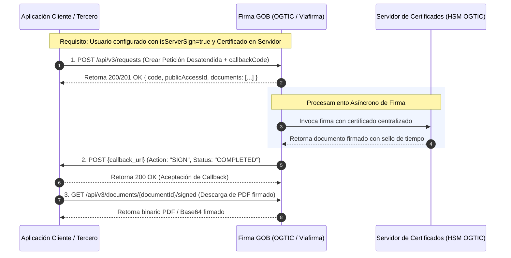

# API de Integración Firma Desatendida y Callback (OGTIC / Firma GOB)

API construida con **Python 3.12 y FastAPI** para la integración con la plataforma **Firma GOB (OGTIC)** basada en **Viafirma Inbox v3**. Implementa el flujo asíncrono completo de **Firma Desatendida (Firma en Servidor / Sello Electrónico)** y **Recepción de Notificaciones Webhook (Callback)**.

---

## 📋 Arquitectura del Flujo (3 Pasos Oficiales)



---

## 🚀 Puesta en Marcha Rápida

### 1. Requisitos
- Python 3.12+ (instalado en el sistema)
- Entorno virtual ya configurado en `.venv/`

### 2. Iniciar el Servidor
```powershell
# Desde el directorio del proyecto:
.venv\Scripts\python run.py
```

El servicio estará disponible en:
* **Dashboard Interactivo:** [http://localhost:8000/](http://localhost:8000/)
* **Documentación Interactiva (Swagger UI):** [http://localhost:8000/docs](http://localhost:8000/docs)
* **Especificación ReDoc:** [http://localhost:8000/redoc](http://localhost:8000/redoc)

---

## ⚙️ Configuración (`.env`)

El archivo `.env` permite alternar entre el **Simulador Local (Mock)** y el entorno real de **OGTIC**:

```ini
# Configuración Servidor
APP_ENV=development
APP_PORT=8000
APP_HOST=0.0.0.0

# MODO SIMULADOR / MOCK OGTIC
# En True: Simula el comportamiento del HSM y dispara el callback automáticamente tras 2s.
ENABLE_MOCK_OGTIC=True
MOCK_SIGN_DELAY_SECONDS=2

# CONFIGURACIÓN REAL DE FIRMA GOB (OGTIC)
# Cuando OGTIC asigne las credenciales de QA o Producción:
# FIRMAGOB_BASE_URL=https://firmagob-qa.ogtic.gob.do
# FIRMAGOB_USER=api_usuario_ogtic
# FIRMAGOB_PASSWORD=api_clave_ogtic
# FIRMAGOB_CALLBACK_CODE=CALLBACK_INSTITUCIONAL_01
FIRMAGOB_BASE_URL=http://localhost:8000/mock-ogtic
FIRMAGOB_USER=api_user_ogtic
FIRMAGOB_PASSWORD=api_password_ogtic
FIRMAGOB_CALLBACK_CODE=CALLBACK_INSTITUCIONAL_01

# URL donde OGTIC enviará el webhook callback
CALLBACK_URL=http://localhost:8000/api/v1/firmagob/callback
```

---

## 📡 Endpoints de la API

### 1. Iniciar Firma Desatendida (`POST /api/v1/documents/sign`)
Recibe el JSON oficial de la institución con el documento PDF en Base64 y los metadatos del firmante.

**Cuerpo de la Petición (Request Body):**
```json
{
    "sender": {
        "userCode": "40200000000",
        "entityCode": "default"
    },
    "addresseeLines": [
        {
            "addresseeGroups": [
                {
                    "isOrGroup": false,
                    "userEntities": [
                        {
                            "userCode": "40200000000",
                            "entityCode": "default",
                            "action": "SIGN"
                        }
                    ]
                }
            ]
        }  
    ],
    "internalNotification": [],
    "subject": "Firma Desatendida de Documento Oficial",
    "message": "Solicitud generada automáticamente para firma en servidor.",
    "reference": "EXP-2026-00981",
    "verificationAccess": {
        "type": "ANONYMOUS"
    },
    "senderNotificationLevel": "ALL",
    "signatureLevel": "ALL",
    "notificationUrl": "http://localhost:8000/api/v1/firmagob/callback",
    "callbackCode": "CALLBACK_INSTITUCIONAL_01",
    "useDefaultStamp": true,
    "documentsToSign": [
        {
            "filename": "resolucion_oficial.pdf",
            "data": "JVBERi0xLjQKJcOkw7zDtsOfCjIgMCBvYmoKPDwvTGVuZ3RoIDMgMCBSL0ZpbHRlci9GbGF0ZURlY29kZT4+CnN0cmVhbQ..."
        }
    ]
}
```

**Respuesta Exitosa (`201 Created`):**
```json
{
  "success": true,
  "message": "Solicitud de firma desatendida registrada en Firma GOB con éxito.",
  "trackingId": "e1f14890-5a39-4d6f-870a-7e61a868f0cb",
  "reference": "EXP-2026-00981",
  "firmagob": {
    "code": "8GUD-1I4B-VPVK-M9VD",
    "publicAccessId": "RJLK-OJMO-ZSFH-79EM",
    "documentId": "8RRZ-XYZA-ZBAE-R4GS",
    "status": "IN_PROCESS"
  },
  "nextSteps": "Firma GOB procesará la firma asíncronamente y notificará al webhook configurado."
}
```

---

### 2. Endpoint 2: Webhook Callback (`POST /api/v1/firmagob/callback`)
Endpoint receptor registrado ante OGTIC.
- Responde **inmediatamente `HTTP 200 OK` en `< 5 segundos`** con `{ "result": "ok" }`.
- Lanza una tarea en segundo plano (`BackgroundTasks`) que descarga el PDF firmado (`Endpoint 3: GET /api/v3/documents/{documentId}/signed`) y actualiza el estado en la base de datos a `COMPLETED`.

**Payload recibido desde OGTIC:**
```json
{
  "publicAccessId": "RJLK-OJMO-ZSFH-79EM",
  "action": "SIGN",
  "status": "COMPLETED"
}
```

---

### 3. Consultar y Descargar Documentos

* **Listar solicitudes:** `GET /api/v1/documents`
* **Consultar estado:** `GET /api/v1/documents/{trackingId}`
* **Descargar documento:** `GET /api/v1/documents/{trackingId}/download` (Retorna el PDF firmado con sello digital PAdES si ya finalizó, o el original si aún está en proceso).

---

## 📮 Pruebas con Postman

Se incluye la colección oficial lista para importar en Postman:
- **Colección Postman:** [`FirmaGOB_Postman_Collection.json`](file:///c:/Users/onix0/Desktop/API%20Creator%20Document/FirmaGOB_Postman_Collection.json)
- **Guía paso a paso:** [`POSTMAN_GUIDE.md`](file:///c:/Users/onix0/Desktop/API%20Creator%20Document/POSTMAN_GUIDE.md)

### Cómo importarla:
1. En Postman, haz clic en **Import**.
2. Selecciona el archivo `FirmaGOB_Postman_Collection.json`.
3. Ejecuta la petición **"1. Iniciar Firma Desatendida"**: Postman extraerá automáticamente los identificadores `trackingId` y `publicAccessId` para que puedas consultar el estado o descargar el PDF con un solo clic.

---

## 🧪 Pruebas Automatizadas en Terminal

Se incluye también un script de prueba de integración de ciclo completo:
```powershell
python test_flow.py
```
Este script genera un PDF válido, envía la petición de firma, espera la notificación del webhook y verifica la descarga del documento firmado.
